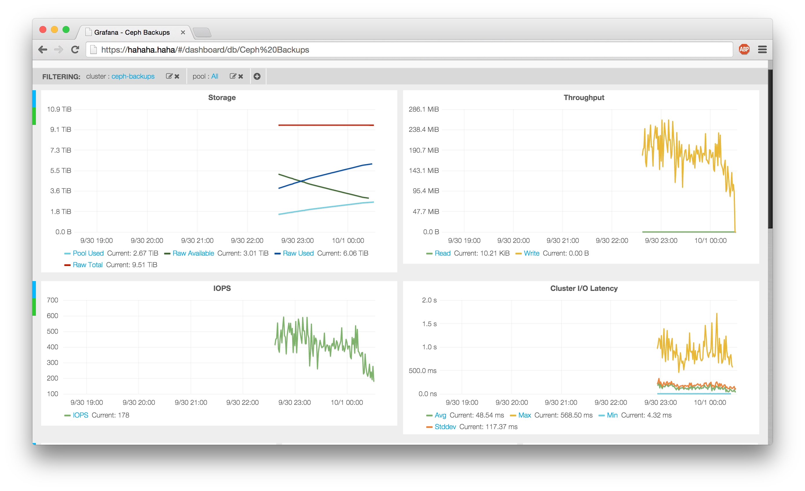

# Collect ceph metrics to graphite

This is dockerized version of [collectd-ceph](https://github.com/rochaporto/collectd-ceph).
You only need docker to run this, ceph to monitor and graphite to store metrics.

## Running

```
docker run -d -e HOST_NAME=$(hostname -s) -e GRAPHITE_HOST=<graphite host> \
  -e GRAPHITE_PORT=2003 -v </etc/ceph/of/running/cluster>:/etc/ceph:ro \
  -e GRAPHITE_UPDATE_INTERVAL=30 -e GRAPHITE_PREFIX=collectd. \
  -e CEPH_CLUSTER_NAME=<my ceph cluster> \
  bobrik/ceph-collectd-graphite
```

Environment variables:

* `HOST_NAME` - hostname to use in graphite.
* `GRAPHITE_HOST` - host where carbon is listening for data.
* `GRAPHITE_PORT` - port where carbon is listening for data, `2003` by default.
* `GRAPHITE_UPDATE_INTERVAL` - metric update interval, `30` by default
* `GRAPHITE_PREFIX` - prefix for metrics in graphite, `collectd.` by default.
* `CEPH_CLUSTER_NAME` - cluster name to use in graphite.

Note that you must pass `/etc/ceph` into container to collect metrics.

This image builds from `ceph/base` and has the same tags.

Check out [collectd-ceph](https://github.com/rochaporto/collectd-ceph)
for more info and awesome grafana dasboard:



# Authors

* [Ian Babrou](https://github.com/bobrik)
